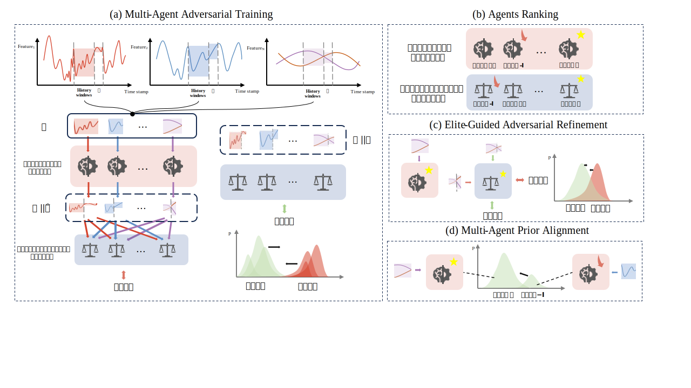

# MAA
<p>Code base of 
    <span style="color:#2E8B57;">M</span>ulti- 
    <span style="color:#1E90FF;">A</span>gent 
    <span style="color:#8B0000;">A</span>dversarial
    <span style="color:#FF8C00;">T</span>ime 
    <span style="color:#FFD700;">S</span>eries
    <span style="color:#800080;">F</span>orecasting
    (MAA-TSF)
</p>

---

## Overall paradigm


## Brief Intro

### A class inherit structure:

```
MAAbase
 | 
 | -- MAA time series
 | -- MAA {image} generation 
 | -- ... {more other generation tasks}
```

### Initialize models: 
- N generators, e.g. [GRU, LSTM, Transformer]  # 3 generator models
- N discriminators, e.g. [CNND1, CNND2, CNND3]  # 3 discriminator models

- Generators use past window size to predict next 1 (to N maybe will realize in the future version) timestamp.
- Discriminators use past window size concatting predict label to discriminate and adversarial train

### Main loop: 
Now following are the present code logic. (Please point out if there exists any faults)
``` 
FOR e in EPOCHS: 
  # Main training loop
  # 1. Individual pre-training
  for generator in generators:
      train(generator, loss_fn=MSE, Cross Entropy)  # Train each generator separately with MSE loss
      
  for discriminator in discriminators:
      train(discriminator, loss_fn=ClassificationLoss)  # Train each discriminator with classification loss (0: no change, 1: up, -1: down)

  while e % k ==0: 
    # 2. Intra-group evaluation and selection
    best_generator = evaluate_and_select_best(generators, validation_data)
    best_discriminator = evaluate_and_select_best(discriminators, validation_data)
      
    # 3. Intra-group knowledge distillation
    distill(best_generator, worst_generator)
     
    # 4. Cross-group competition
    FOR e0 in k0: 
      adversarial_train(best_generator, best_discriminator)
      if not converge: 
        break
```

---

# Code Execution Guide

This guide will walk you through setting up the environment, preparing the dataset, and running our Python code.

## 1. Environment Setup

Required Site Packages:


## 2. Dataset Preparation

The dataset is essential for running the code. Please download the dataset file from the following links:

* [Google Drive](https://drive.google.com/drive/folders/1-Nr35rIcindBcCdlQJsoyaOUfOZQacx8?usp=sharing)
* [Baidu Cloud](https://pan.baidu.com/s/1qhd4Vw0aJ37ETxD4PkA4pQ?pwd=38tv)

Once downloaded, please place the dataset file in the directory specified by your `DATA_FILE` variable. Ensure that when you run the script or command, the `DATA_FILE` variable points to this correct directory path.

For example, if your dataset file is named `my_dataset.csv` and you want to place it in a `data` folder within your project's root directory, then `DATA_FILE` should point to `data/my_dataset.csv`.

```
DATA_FILE/
├── my_dataset.csv  # The dataset file should be placed here
├── processed_xxx_day.csv 
├── ...

MAA/
├── models/
├── utiils/
├── run_multi_gan.py
└── ...
└── run_all.sh
└── ...
```

## 3. Running the Code

You can run the code using the following two methods:

### Method 1: Running the `run_all.sh` Script (Recommended for Batch Experiments)

If you need to run a series of predefined experiments, you can directly execute the `run_all.sh` script. This script will run experiments in batches according to the parameters defined within it.

In your terminal, navigate to your project directory and execute:

```bash
chmod +x run_all.sh # If the script doesn't have execute permission, add it first
./run_all.sh
```

Please ensure that the `DATA_FILE` and `OUTPUT_DIR` variables set within the `run_all.sh` script point to the correct data path and output results path.

### Method 2: Running `run_multi_gan.py` Directly

If you only need to run a single experiment or for debugging purposes, you can run `run_multi_gan.py` directly and specify configurations via command-line arguments.

Here is an example command to run `run_multi_gan.py` directly:

```bash
python run_multi_gan.py \
    --data_path "$DATA_FILE/processed_Oil_day.csv" \
    --output_dir output \
    --feature_columns 2 19 2 19 2 19 \
    --start_timestamp  1065 \
    --end_timestamp 4275 \
    --N_pairs 3 \
    --distill_epochs 1 \
    --cross_finetune_epochs 5
```

Please replace the placeholder variables in the command, details of arguements can be found in `run_multi_gan.py`

You can modify the values of these parameters according to your experiment requirements.

---